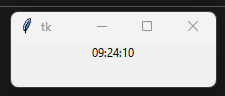

# ⏰ Relógio Tkinter 

## Descrição

Este repositório contém um programa em Python que cria uma tela usando Tkinter e mostra um relógio em tempo real.

## Objetivo

Este projeto tem como objetivo apresentar conhecimentos básicos em interface gráfica com Tkinter e o básico de programação orientada a objetos.

## Como Executar

Para executar o programa, certifique-se de ter o Python 3.x e a biblioteca Tkinter 8.6 instalados em seu computador.

Em seguida, abra o terminal na pasta do projeto e execute o seguinte comando:

## Screenshots

## Autor

Este projeto foi criado por LUKAS.
